# The Jetta Manual

For the people who work tickets. Ten chapters, in the order you'll meet them.

Jetta is our AI support agent. Every incoming Freshdesk ticket runs through it: it reads the ticket, searches the knowledge base, checks the customer's account and the dev board, works out which of our apps the ticket is about, and writes a suggested reply.

The console lives at **https://jettajetpack.vercel.app**.

> **The one rule.** On Freshdesk, nothing reaches a customer until a human sends it. Live chat is the exception — there Jetta replies to visitors directly, with nobody reading first. Almost everything else in this manual follows from those two sentences.

---

## 1. What Jetta actually does

A ticket arrives. Jetta reads it, retrieves what it knows, and writes a reply — then posts that reply as a **private note on the ticket**. Customers never see private notes. You copy it, change what you want, and send it as yourself.

That means there is no queue to clear and no console step in the critical path. If you never opened the console again, tickets would still get answered, because the suggestion is sitting on the ticket where you already work.

**Not every ticket gets a suggestion.** Out-of-office replies, bounces, marketing and spam are filtered out before Jetta runs. A ticket with no private note on it is usually one Jetta was never meant to answer — not a failure.

**Live chat is different, and that difference matters.** In the website widget Jetta is the front line: it answers visitors live, unreviewed. Chapter 5 is about the review that happens afterwards instead.

---

## 2. Signing in

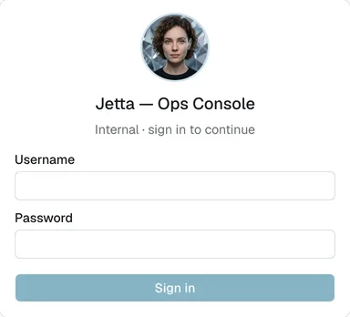

Use your own username — every decision you make is recorded under your name. Sessions last seven days.

If you're an admin, you'll see a **View as general** control in the header. It's a real downgrade, not a preview: while it's on, you get exactly the surfaces a general user gets.

---

## 3. Your morning: the Today page

Start here. One screen for the overnight read: what came in, what's spiking, and what needs a person.

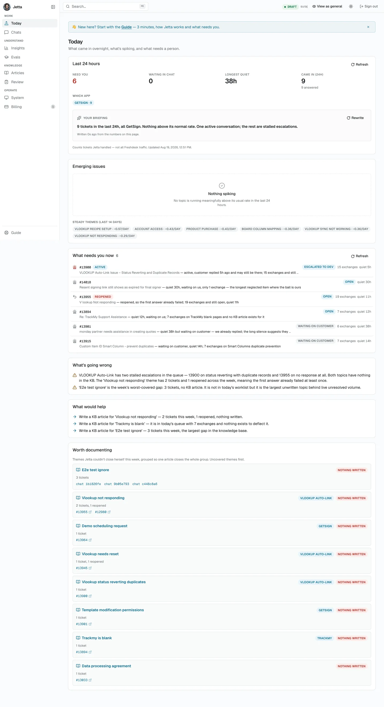

Every number on this page counts **tickets Jetta handled** — not all Freshdesk traffic.

### Last 24 hours

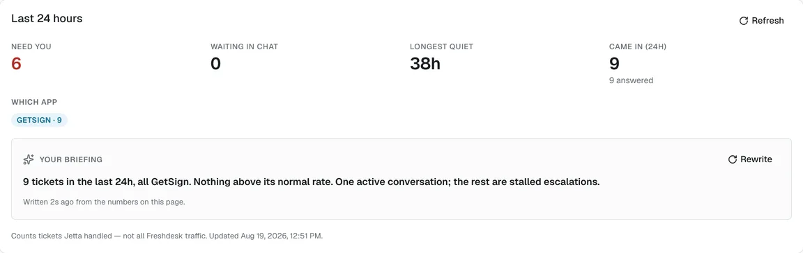

Four tiles — **Need you**, **Waiting in chat**, **Longest quiet**, **Came in (24h)** — then a breakdown of which app the volume landed on.

**Your briefing** sits inside this card: a short written read of the numbers on the page, regenerated when they change. It's commentary, not data — the tiles and lists below are the source of truth. **Rewrite** forces a fresh one.

### Emerging issues

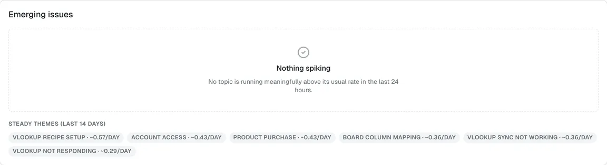

A topic has to clear two bars to appear here: at least **3 tickets in 24 hours** *and* **3× its daily average** over the previous 14 days. An ordinary busy day doesn't cry wolf.

Each issue shows which app it hit and whether the knowledge base already covers it. The distinction is the useful part:

- **in KB** — an answer exists and customers aren't finding it. That's a findability problem.
- **no KB article** — nothing is written. That's a writing job.

When nothing is spiking you get **Steady themes** instead: the normal background rate, so you can see what routine looks like.

### What needs you now

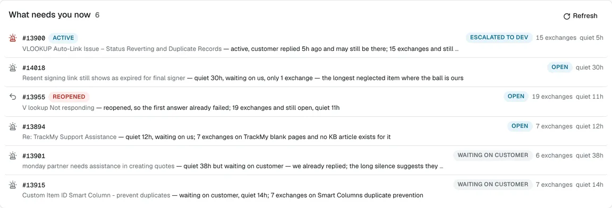

The work on this page that is actually yours. Each row carries a state, how many exchanges have happened, and how long it's been quiet:

| State | What it means |
|---|---|
| **Active** | The customer replied recently and may still be there. |
| **Open** | Waiting on us. The ball is ours. |
| **Reopened** | Jetta's answer didn't land and the customer came back. |
| **Waiting on customer** | We've replied. A long silence here may just mean they dropped it. |

**Reopened is the highest-signal item on the page.** It means the first answer already failed once.

### What's going wrong, and what would help

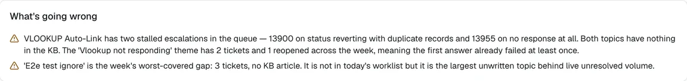

A written read of the patterns behind the queue — which topics have stalled escalations, which have nothing in the knowledge base, which themes have already failed an answer.

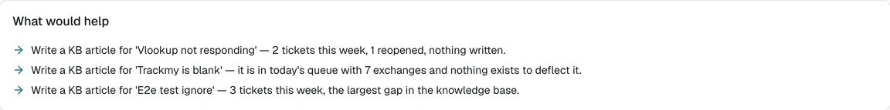

The same analysis turned into specific jobs, usually "write this article, because it has *this* many tickets and nothing written."

### Worth documenting

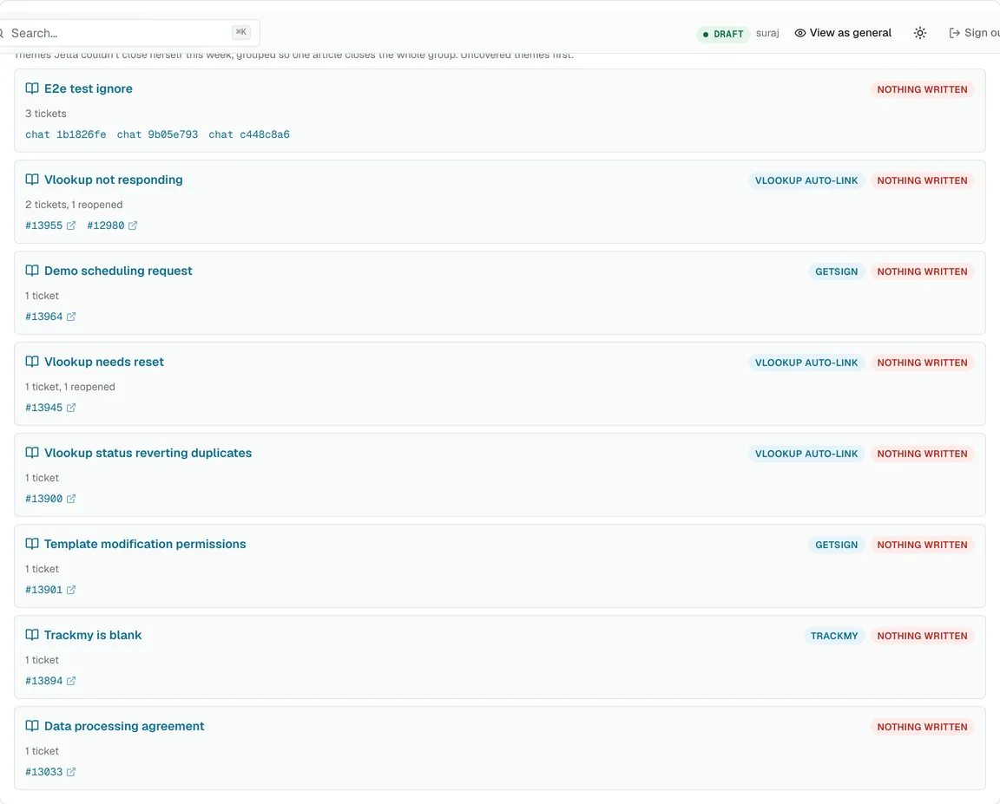

The week's unresolved tickets grouped **by theme**, worst-covered first, so one article closes a whole group rather than a single ticket. Each group lists the tickets and chats behind it.

---

## 4. Replying to a ticket

This is the whole job, and it happens in Freshdesk — not here.

Open the ticket. Jetta's suggestion is in a private note. Copy it into the reply editor, change whatever you want, send as yourself. That's it.

<div class="placeholder">Screenshot needed: Jetta's suggestion as a private note on a Freshdesk ticket.</div>

**Writing the reply *is* the feedback.** Jetta reads back what you actually sent, compares it against what it suggested, and records the difference on its own — sent as-is, edited, or replaced entirely. You never have to tell it anything, and there is no button to press. This is the single most important thing to understand about the whole system: chapter 7 exists because of this paragraph.

<div class="placeholder">Screenshot needed: the reply editor with an edited version of Jetta's suggestion.</div>

Two behaviours worth knowing:

- If the customer writes again while a suggestion is waiting, the old one is marked **superseded** and Jetta writes a fresh one against the new message.
- If nobody ever replies, the suggestion quietly **expires** after two weeks instead of piling up. An expired suggestion is not a black mark against anyone.

### The audit trail

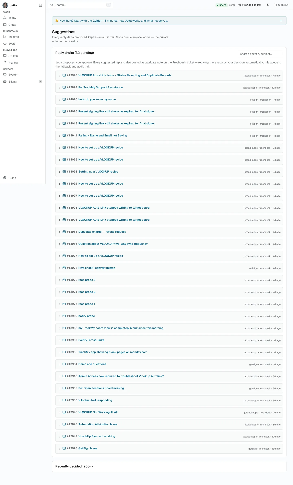

Every suggestion Jetta has ever proposed is kept at `/drafts`. It shows a pending count, and that count will look alarming — it is not a backlog. **Nobody works this queue.** The private note on the ticket is the real surface; this is the paper trail for when you need to ask "what did it say, and when?"

That's also why `/drafts` isn't in the navigation.

---

## 5. Live chat: where Jetta answers alone

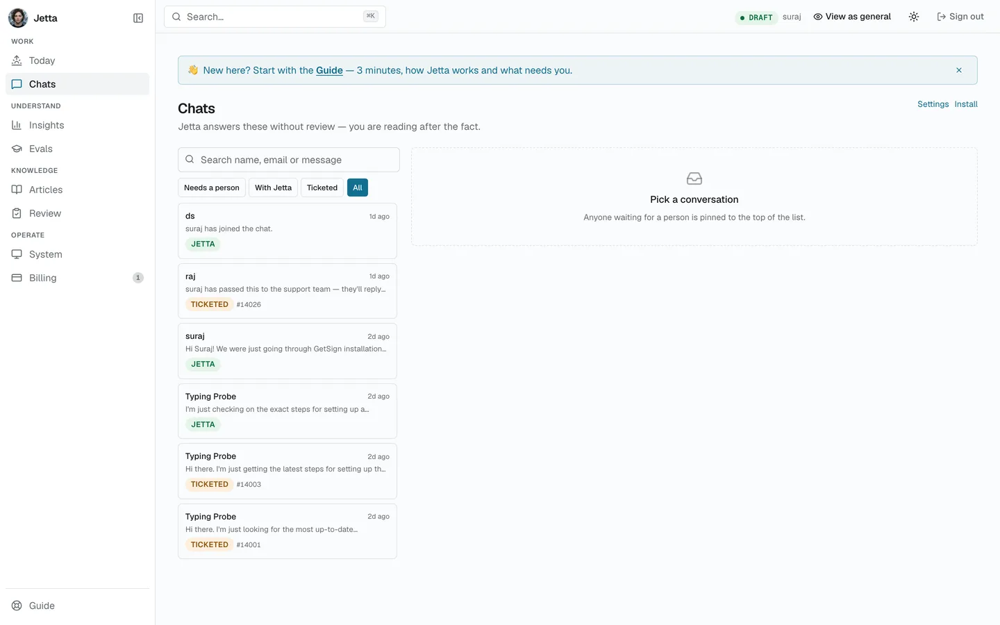

In the website widget, Jetta replies to visitors live with nobody reading first. This page is the compensating control for that. Skim the transcripts, reading for three things: a wrong fact, a confident answer to something that should have been escalated, or a tone we wouldn't use.

The filters across the top are **Needs a person**, **With Jetta**, **Ticketed** and **All**.

### Reading and taking over a conversation

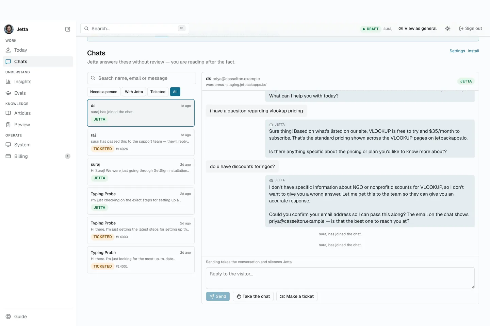

Pick a conversation and the transcript opens beside the list. Two controls matter:

- **Take the chat** — you join the conversation. From then on you're typing to the visitor yourself and Jetta stops answering. Sending a message takes the conversation and silences Jetta, so don't type a note to yourself in there.
- **Make a ticket** — opens a Freshdesk ticket carrying the whole transcript. The conversation becomes **Ticketed** and the two point at each other, so neither side is a dead end.

A visitor who asks for a person moves to **Needs a person**, pins to the top, and pings Slack. The visitor always sees who is speaking, so a handover is never silent.

Jetta opens tickets herself when she can't resolve something — the button is for when you decide before she does.

---

## 6. Asking Jetta in Slack

Jetta answers direct messages and questions in the agent panel. It is **read-only there by construction**: it can look things up and explain them, but it cannot change anything from a DM. That makes it a safe Freshdesk stand-in for people who don't have a Freshdesk login.

<div class="placeholder">Screenshot needed: a DM conversation with Jetta answering a lookup question.</div>

Escalations land in **#jetta-escalations**. When Jetta posts there, it's because it decided a person was needed — treat the channel as a worklist, not a feed.

<div class="placeholder">Screenshot needed: an escalation post in #jetta-escalations.</div>

---

## 7. Teaching Jetta: the Evals page

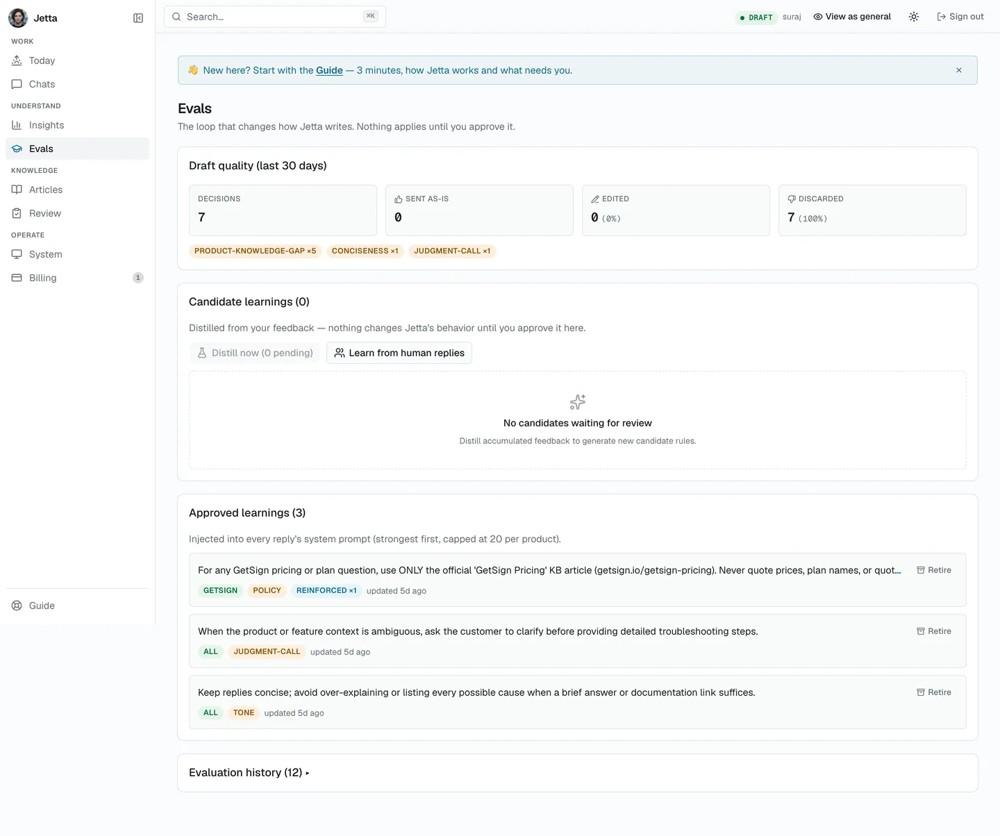

This is the loop that changes how Jetta writes, and the one page that genuinely needs a human. Nothing here applies until someone approves it.

### Draft quality

The top card scores the last 30 days: **Decisions**, **Sent as-is**, **Edited**, **Discarded** — plus the reasons your edits clustered around, tagged things like `product-knowledge-gap`, `conciseness` and `judgment-call`.

Read the tags before the numbers. A high discard rate with `product-knowledge-gap` on most of them is a knowledge base problem, not a writing problem.

### From your replies to a rule


Three steps, in order:

1. **Learn from human replies** — replays recently resolved tickets, compares what Jetta would have written against what you actually sent, and records every meaningful divergence. Your ordinary replies are the training data.
2. **Distill now** — turns accumulated divergences into short candidate rules. Patterns only; a one-off never becomes a rule.
3. **Approve or reject** — nothing changes until you approve. Approved rules are injected into every reply's system prompt from then on, strongest first, capped at 20 per product.

**Approve narrowly.** A rule is permanent instruction until someone **retires** it. Here's a real one, and note how tightly it's scoped:

> For any GetSign pricing or plan question, use ONLY the official 'GetSign Pricing' KB article. Never quote prices, plan names, or quotas from comparison or feature articles — those are stale and conflicting.

That rule exists because a customer was quoted a wrong price. It names one article, one topic, one product.

### Which goes where

The line that saves the most confusion:

| Kind of thing | Where it belongs |
|---|---|
| A **fact** — "the Pro plan is $29" | Knowledge Base |
| A **behaviour** — "ask which board before troubleshooting a sync" | Evals |

---

## 8. The Knowledge Base

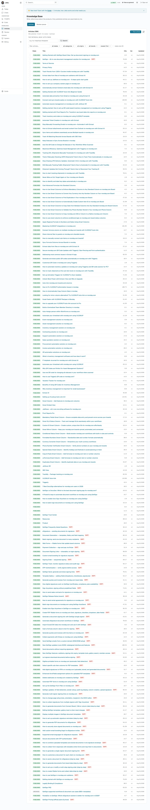

What Jetta knows about the products. Articles move through four states — **draft → in review → published → archived** — and only one of them matters day to day:

**Only published articles are searchable by Jetta.** A perfect draft is invisible to her.

The list shows each article's state, hit count, version, and a **DUP?** flag where two articles look like duplicates. **Test retrieval** is the box to use when you want to know what Jetta would actually find for a given question — it's the fastest way to answer "why did she say that?" about a fact.

The knowledge base syncs daily from our websites, so most articles maintain themselves.

### The review queue

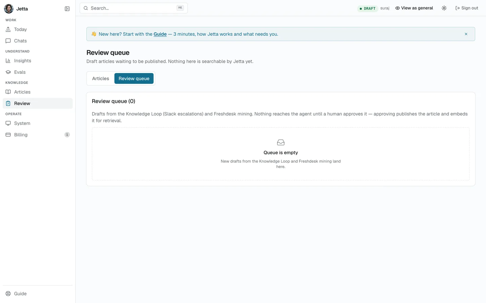

Draft articles waiting to be published, from two sources: the Knowledge Loop (Slack escalations) and Freshdesk mining. Nothing here reaches Jetta yet.

Approving does two things at once — it publishes the article *and* embeds it for retrieval. That's the moment it starts affecting answers.

---

## 9. The other pages, briefly

### Billing

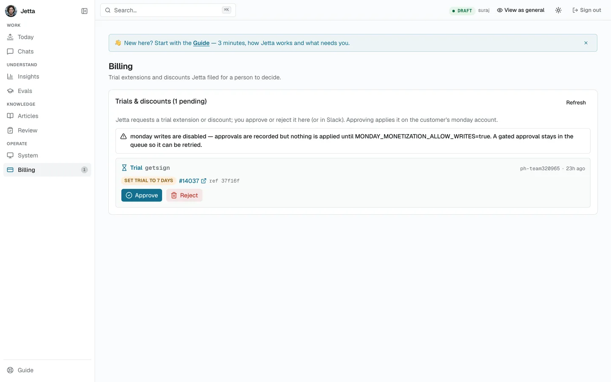

Trial extensions and discounts Jetta won't grant itself, filed for a human. Approve or reject here or in Slack. Pending requests expire after three days, so an ignored one never quietly grants itself.

### Insights

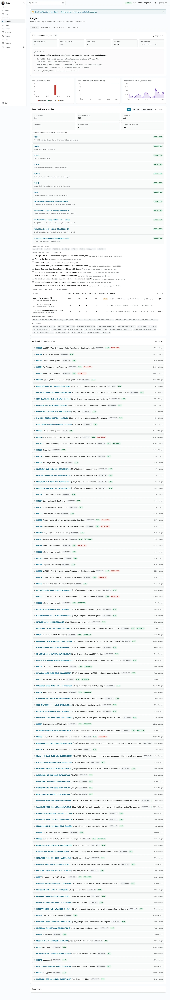

The ops view. **Daily overview** is yesterday's rollup with a written narrative and a **Regenerate** button.

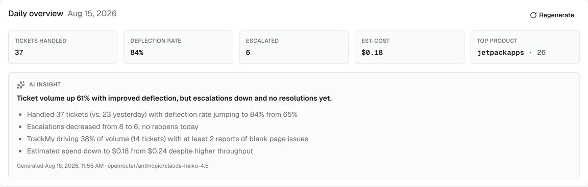

Below it: decisions per day, edit and discard rate, token spend, and per-model quality. Volume is always broken down per app — never as one "Jetpack Apps" lump.

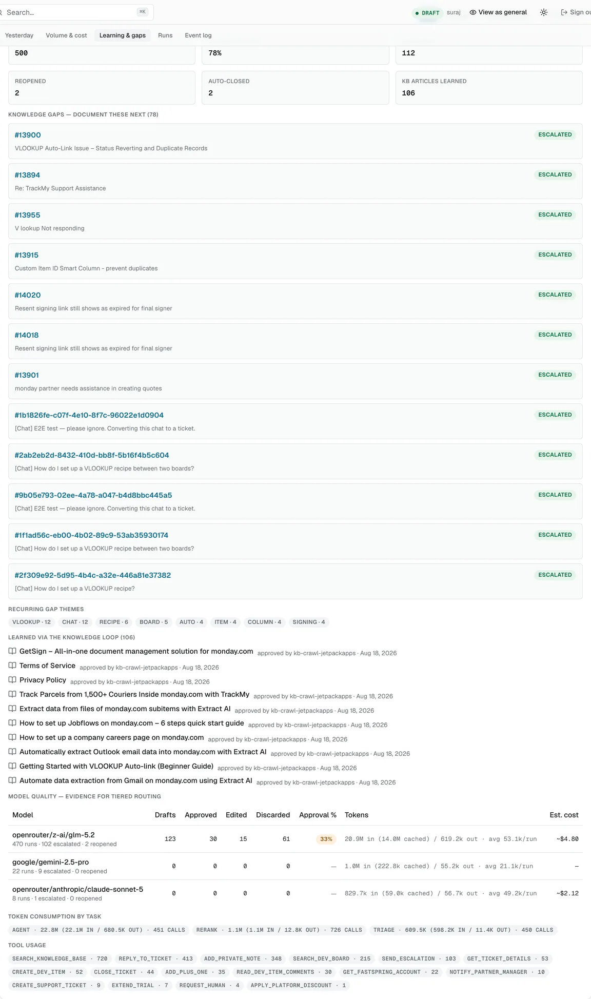

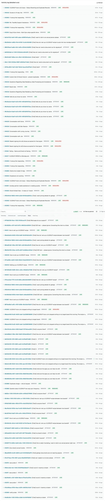

**Activity log** is every run in detail, and the **Event log** below it is the raw stream — where you go when you need to know exactly what happened and when.

### System

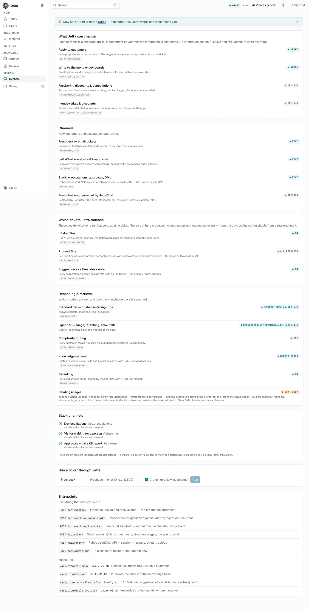

The truth page. Every capability is a separate opt-in, independent of whether the integration is connected — an integration can be fully live and still unable to write anything. It shows whether replies are in draft mode, which channels are live, which tickets Jetta touches, and which models answer.

If you ever want to know whether Jetta *can* do something, this page answers it rather than the docs.

---

## 10. Ground rules

**Read before you send. You are the last check.** Jetta writes confidently whether or not it's right. Check facts, prices, links and account details — especially anything about money.

**If a suggestion is wrong, just write your own reply.** Don't work around it or fix it half-way. That disagreement is exactly what the learning loop feeds on, and a replaced reply teaches more than an edited one.

**Never cancel a subscription** unless the customer has clearly asked for it. No exceptions, no inference from silence.

**If something looks broken** — wrong customer data, a reply about the wrong product, a queue that won't clear — ping Suraj rather than working around it.

---

## Appendix: the chat widget

Two admin pages, included so you know they exist.

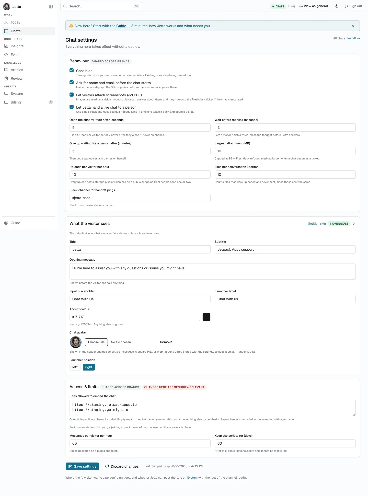

Appearance and limits for the widget. The **Access & limits** section is shared across brands and is security-relevant: the list of origins allowed to embed the chat is what stops anyone else putting our chat on their site. Every change is recorded in the event log with your name.

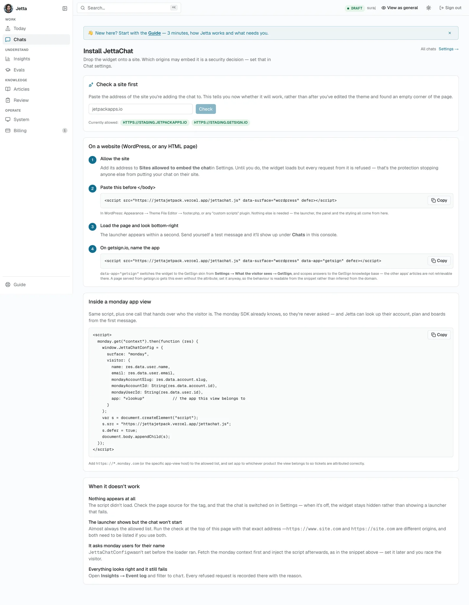

How the widget gets onto a site, including a checker that tells you whether an origin will work *before* you theme it and find an empty corner of the page.

---

## About this manual

Every screenshot is generated from the live console by `scripts/manual-shots.mjs`, so the manual can be regenerated rather than slowly going out of date:

```
MANUAL_USER=… MANUAL_PASS=… node scripts/manual-shots.mjs
```

The harness refuses to photograph a page showing an error, and swaps real email addresses for a consistent fake cast before each shot. The four gaps marked above are Freshdesk and Slack screens, which it can't reach.
