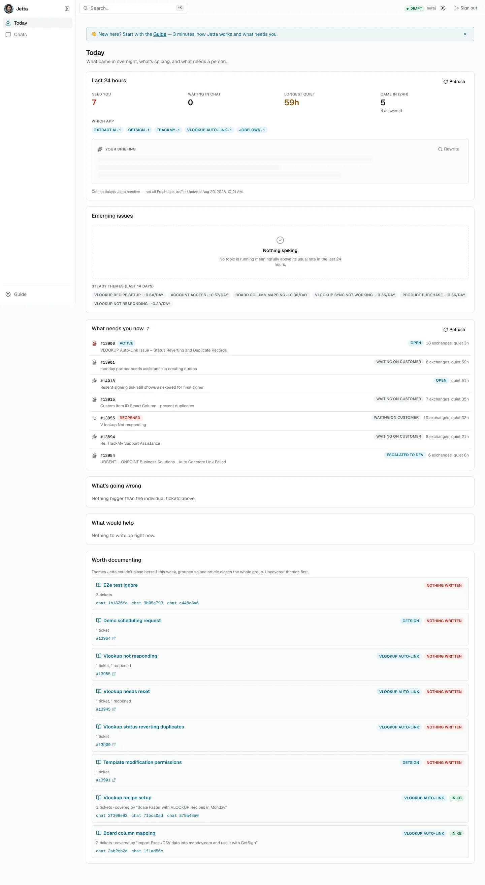
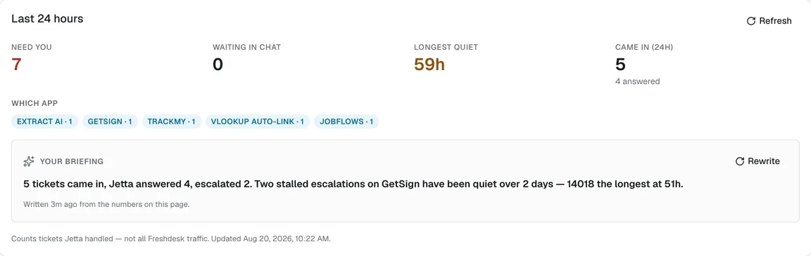
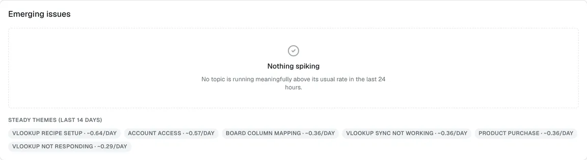
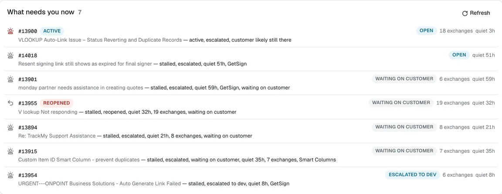
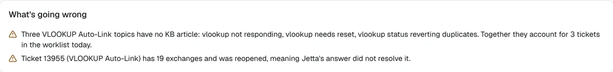
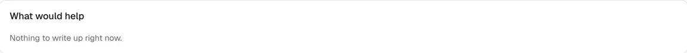
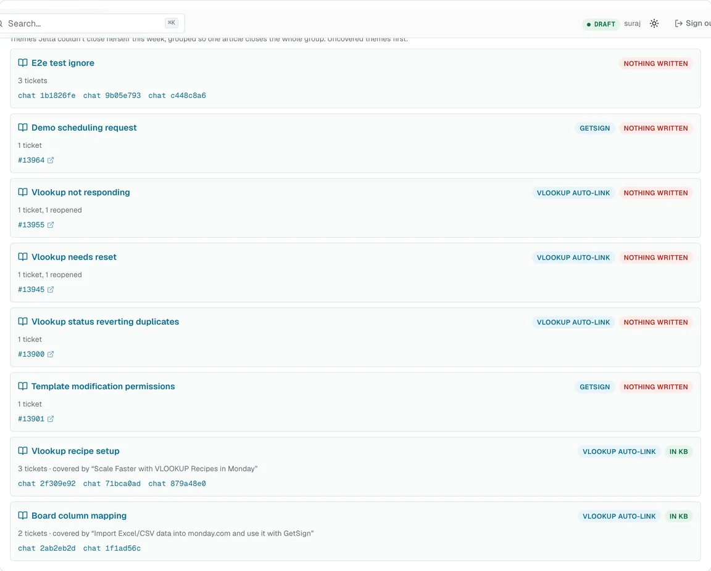
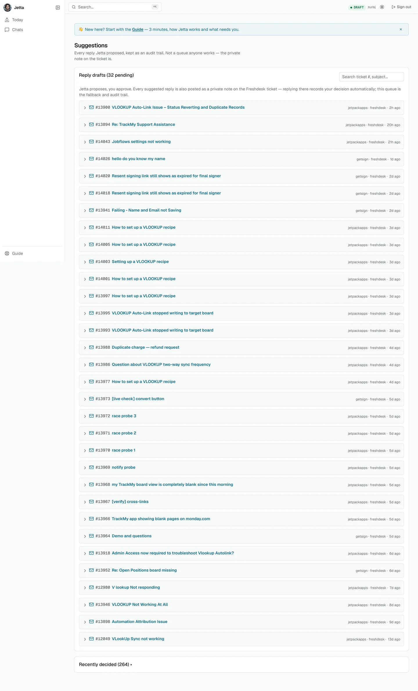
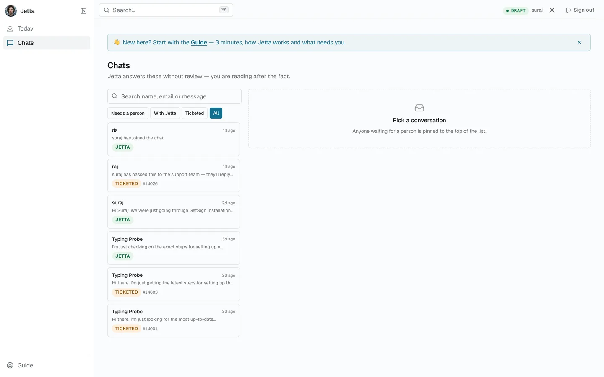
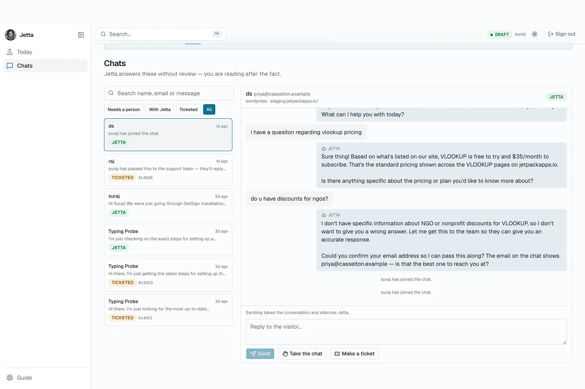

# Working With Jetta

Everything you need for the support job, and nothing you don't. Seven short chapters.

Jetta is our AI support agent. Every incoming Freshdesk ticket runs through it: it reads the ticket, searches the knowledge base, checks the customer's account and the dev board, works out which of our apps the ticket is about, and writes a suggested reply.

The console lives at **https://jettajetpack.vercel.app**.

> **The one rule.** On Freshdesk, nothing reaches a customer until a human sends it. Live chat is the exception — there Jetta replies to visitors directly, with nobody reading first. Almost everything in this handbook follows from those two sentences.

---

## 1. What Jetta actually does

A ticket arrives. Jetta reads it, retrieves what it knows, and writes a reply — then posts that reply as a **private note on the ticket**. Customers never see private notes. You copy it, change what you want, and send it as yourself.

So there is no queue to clear and no console step in the critical path. If you never opened the console again, tickets would still get answered, because the suggestion is sitting on the ticket where you already work.

**Not every ticket gets a suggestion.** Out-of-office replies, bounces, marketing and spam are filtered out before Jetta runs. A ticket with no private note on it is usually one Jetta was never meant to answer — not a failure, and not something to chase.

**Live chat is different.** In the website widget Jetta is the front line: it answers visitors live, unreviewed. Chapter 5 is about the review that happens afterwards instead.

---

## 2. Signing in


Use your own username — every decision you make is recorded under your name. Sessions last seven days.

You'll see three things in the sidebar: **Today**, **Chats**, and **Guide**. That's the shape of your day, and this handbook covers all three.

Those three tabs are about attention, not permission. A direct link to a page that isn't in your sidebar will still open, and you can draft a knowledge base article there — you just can't be the one who publishes it. Chapter 7 covers where that line sits.

---

## 3. Your morning: the Today page

Start here. One screen for the overnight read: what came in, what's spiking, and what needs a person.



Every number counts **tickets Jetta handled** — not all Freshdesk traffic.

### Last 24 hours



Four tiles — **Need you**, **Waiting in chat**, **Longest quiet**, **Came in (24h)** — then which app the volume landed on.

**Your briefing** sits inside this card: a short written read of the numbers on the page. It's commentary, not data — the lists below are the source of truth. **Rewrite** forces a fresh one.

### Emerging issues



A topic has to clear two bars to show up here: at least **3 tickets in 24 hours** *and* **3× its daily average** over the previous 14 days. An ordinary busy day doesn't cry wolf.

Each one tells you whether the knowledge base already covers it, and that distinction decides what to do:

- **in KB** — an answer exists and customers aren't finding it.
- **no KB article** — nothing is written yet.

When nothing is spiking you get **Steady themes** instead: the normal background rate, so you can see what routine looks like.

### What needs you now



This is your list. Each row carries a state, how many exchanges have happened, and how long it's been quiet:

| State | What it means |
|---|---|
| **Active** | The customer replied recently and may still be there. |
| **Open** | Waiting on us. The ball is ours. |
| **Reopened** | Jetta's answer didn't land and the customer came back. |
| **Waiting on customer** | We've replied. A long silence may just mean they dropped it. |

**Reopened is the highest-signal item on the page.** It means the first answer already failed once, so read the thread before replying again.

### What's going wrong, and what would help



A written read of the patterns behind the queue — which topics have stalled, which have nothing in the knowledge base, which themes have already failed an answer.



The same analysis turned into specific jobs, usually "write this article, because it has *this* many tickets and nothing written."

### Worth documenting



The week's unresolved tickets grouped **by theme**, worst-covered first, so one article closes a whole group rather than a single ticket.

---

## 4. Replying to a ticket

This is the job, and it happens in Freshdesk — not here.

Open the ticket. Jetta's suggestion is in a private note. Copy it into the reply editor, change whatever you want, send as yourself. That's the whole workflow.

<div class="placeholder">Screenshot needed: Jetta's suggestion as a private note on a Freshdesk ticket.</div>

**Writing the reply *is* the feedback.** Jetta reads back what you actually sent, compares it against what it suggested, and records the difference on its own — sent as-is, edited, or replaced entirely. You never have to tell it anything, and there is no button to press.

That's worth sitting with, because it changes how you should think about a bad suggestion: rewriting it isn't extra work that goes nowhere. It's the input that makes the next one better.

<div class="placeholder">Screenshot needed: the reply editor with an edited version of Jetta's suggestion.</div>

Two behaviours worth knowing:

- If the customer writes again while a suggestion is waiting, the old one is marked **superseded** and Jetta writes a fresh one against the new message.
- If nobody ever replies, the suggestion quietly **expires** after two weeks instead of piling up. An expired suggestion is not a black mark against anyone.

### If you want to see what it suggested



Every suggestion Jetta has proposed is kept at `/drafts`, with a pending count that will look alarming. **It is not a backlog and nobody works it.** The private note on the ticket is the real surface; this is the paper trail for when you need to ask "what did it say, and when?"

---

## 5. Live chat: where Jetta answers alone



In the website widget, Jetta replies to visitors live with nobody reading first. This page is the compensating control for that.

Skim the transcripts, reading for three things: a wrong fact, a confident answer to something that should have been escalated, or a tone we wouldn't use. The filters across the top are **Needs a person**, **With Jetta**, **Ticketed** and **All**.

### Taking over a conversation



Pick a conversation and the transcript opens beside the list. Two controls matter:

- **Take the chat** — you join. From then on you're typing to the visitor yourself and Jetta stops answering. Sending a message takes the conversation and silences Jetta, so don't type a note to yourself in there.
- **Make a ticket** — opens a Freshdesk ticket carrying the whole transcript. The conversation becomes **Ticketed** and the two point at each other, so neither side is a dead end.

A visitor who asks for a person moves to **Needs a person**, pins to the top of the list, and pings Slack. The visitor always sees who is speaking, so a handover is never silent.

Jetta opens tickets herself when she can't resolve something — the button is for when you decide before she does.

---

## 6. Asking Jetta in Slack

Jetta answers direct messages and questions in the agent panel. It is **read-only there**: it can look things up and explain them, but it cannot change anything from a DM.

That makes it the fastest way to answer "what happened with this customer?" without opening anything — and it's the Freshdesk stand-in if you don't have a Freshdesk login.

<div class="placeholder">Screenshot needed: a DM conversation with Jetta answering a lookup question.</div>

Escalations land in **#jetta-escalations**. When Jetta posts there, it decided a person was needed — treat it as a worklist, not a feed.

<div class="placeholder">Screenshot needed: an escalation post in #jetta-escalations.</div>

---

## 7. Ground rules, and what needs an admin

**Read before you send. You are the last check.** Jetta writes confidently whether or not it's right. Check facts, prices, links and account details — especially anything about money.

**If a suggestion is wrong, just write your own reply.** Don't work around it or half-fix it. That disagreement is exactly what the learning loop feeds on, and a replaced reply teaches more than an edited one.

**Never cancel a subscription** unless the customer has clearly asked for it. No exceptions, and never infer it from silence.

**If something looks broken** — wrong customer data, a reply about the wrong product, a queue that won't clear — ping Suraj rather than working around it.

### The admin line

You can do the whole support job and anything reversible: answer a live chat, draft an article, read every transcript. The things reserved for an admin are the ones that change **every future reply**, **spend money**, or decide **who may embed the chat**:

| You want to | Ask an admin to |
|---|---|
| Get a knowledge base article live | Publish it — drafting is yours, publishing is theirs |
| Turn a recurring correction into a rule Jetta follows | Approve the learning |
| Extend a trial or grant a discount | Approve the request |
| Allow the chat widget on a new site | Change the embed list |

Spotting these is genuinely useful work. If you keep correcting Jetta the same way, say so — that's a rule waiting to be written. If customers keep asking something with no article behind it, say that too.

---

## About this handbook

Every screenshot is captured from the live console, as a general user sees it, by `scripts/manual-shots.mjs`:

```
MANUAL_USER=… MANUAL_PASS=… MANUAL_VIEW=general node scripts/manual-shots.mjs
```

The four gaps marked above are Freshdesk and Slack screens, which the capture tool can't reach.

There is a longer companion manual covering the admin surfaces — the learning loop, the knowledge base, billing approvals and system settings — if you ever need it.
